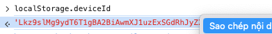

# API lấy lịch sử giao dịch cho Tpbank

## Giới thiệu
API này cung cấp các endpoint để lấy lịch sử giao dịch cho khách hàng của Tpbank.

## TP Bank
B1: Mở trình duyệt đã từng đăng nhập xác minh khuân mặt

B2: Vào trang https://ebank.tpb.vn/retail/vX/ và đăng nhập

B3: Bấm f12, tab console, paste đoạn code sau:

```json
localStorage.deviceId
```

B4: Copy giá trị trả về và sử dụng trong code



## Endpoint

Config file .env thì khi sử dụng endpoint histories không cần tham số nữa

### Lấy lịch sử giao dịch

Có thể dùng **POST** hoặc **GET** với endpoint `/histories`:

#### 1. Dùng GET (tiện nhất khi đã cấu hình .env)
- Lấy tất cả giao dịch:
  ```bash
  curl "http://localhost:3000/histories"
  ```
- Chỉ lấy giao dịch tiền vào:
  ```bash
  curl "http://localhost:3000/histories?category=transaction_CategoryMoneyIn"
  ```
- Có thể truyền category bất kỳ để lọc:
  ```bash
  curl "http://localhost:3000/histories?category=transaction_CategoryOther"
  ```
- **GET sẽ tự lấy thông tin từ .env, không cần truyền body.**

#### 2. Dùng POST (truyền tham số qua body, hoặc để trống nếu đã config .env)
- **Lấy tất cả giao dịch:**
```json
{
  "username": "Tên đăng nhập tpbank",
  "password": "Mật khẩu đăng nhập",
  "accountId": "Số tài khoản",
  "deviceId": "deviceId lấy từ trình duyệt"
}
```
- **Chỉ lấy giao dịch tiền vào:**
```json
{
  "username": "Tên đăng nhập tpbank",
  "password": "Mật khẩu đăng nhập",
  "accountId": "Số tài khoản",
  "deviceId": "deviceId lấy từ trình duyệt",
  "category": "transaction_CategoryMoneyIn"
}
```
- **Nếu config account trong env thì payload chỉ cần:**
```json
{
  "category": "transaction_CategoryMoneyIn"
}
```

#### Tham số
- `username` (Tên đăng nhập)
- `password` (Mật khẩu)
- `accountId` (Số tài khoản cần lấy lịch sử)
- `deviceId` (deviceId lấy từ trình duyệt đã đăng nhập)
- `category` (Tùy chọn, lọc loại giao dịch. "all" để lấy tất cả, "transaction_CategoryMoneyIn" để chỉ lấy giao dịch tiền vào)

## Yêu cầu cài đặt
- Cài Node.js bản 20.x trở lên


*Dùng Postman hoặc các phần mềm tương tự để test với các endpoint là /login và /histories (ví dụ: localhost:3000/login) sau đó điền các tham số đầu vào và gửi để nhận response"# Tpbank-transactions" 
