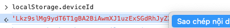

# API lấy lịch sử giao dịch cho Tpbank

## Giới thiệu

API này cung cấp các endpoint để lấy lịch sử giao dịch cho khách hàng của Tpbank.

## Yêu cầu cài đặt

- Node.js phiên bản 20.x trở lên

## Lấy Device ID từ TPBank

**B1:** Mở trình duyệt đã từng đăng nhập xác minh khuôn mặt.

**B2:** Vào trang https://ebank.tpb.vn/retail/vX/ và đăng nhập.

**B3:** Bấm `F12`, chọn tab **Console**, dán đoạn lệnh sau:

```js
localStorage.deviceId
```

**B4:** Copy giá trị trả về và sử dụng làm `deviceId` trong cấu hình.



## Cấu hình

Tạo file `.env` dựa trên `.env.example` và điền các thông tin cần thiết:

```env
TPBANK_USERNAME=your_username_tpbank
PASSWORD="your_password"
DEVICE_ID=your_device_id
ACCOUNT_ID=your_account_id
DAYS=30
```

> Khi đã cấu hình file `.env`, các endpoint sẽ tự động lấy thông tin từ đó và không cần truyền tham số trong request.

## Khởi động

```bash
npm install
npm start
```

## Endpoint

### GET /histories

Lấy lịch sử giao dịch (sử dụng thông tin từ `.env`).

- Lấy tất cả giao dịch:

  ```bash
  curl "http://localhost:3000/histories"
  ```

- Chỉ lấy giao dịch tiền vào:

  ```bash
  curl "http://localhost:3000/histories?category=transaction_CategoryMoneyIn"
  ```

- Lọc theo loại giao dịch tùy chọn:

  ```bash
  curl "http://localhost:3000/histories?category=transaction_CategoryOther"
  ```

### POST /histories

Lấy lịch sử giao dịch với tham số truyền qua body. Nếu đã cấu hình `.env`, các trường `username`, `password`, `accountId`, `deviceId` có thể bỏ qua.

- **Lấy tất cả giao dịch:**

  ```json
  {
    "username": "Tên đăng nhập tpbank",
    "password": "Mật khẩu đăng nhập",
    "accountId": "Số tài khoản",
    "deviceId": "deviceId lấy từ trình duyệt"
  }
  ```

- **Chỉ lấy giao dịch tiền vào:**

  ```json
  {
    "username": "Tên đăng nhập tpbank",
    "password": "Mật khẩu đăng nhập",
    "accountId": "Số tài khoản",
    "deviceId": "deviceId lấy từ trình duyệt",
    "category": "transaction_CategoryMoneyIn"
  }
  ```

- **Khi đã cấu hình `.env`, chỉ cần truyền category:**

  ```json
  {
    "category": "transaction_CategoryMoneyIn"
  }
  ```

### Tham số

| Tham số     | Bắt buộc | Mô tả                                                                                      |
|-------------|----------|--------------------------------------------------------------------------------------------|
| `username`  | Có\*     | Tên đăng nhập TPBank                                                                       |
| `password`  | Có\*     | Mật khẩu đăng nhập                                                                         |
| `accountId` | Có\*     | Số tài khoản cần lấy lịch sử                                                               |
| `deviceId`  | Có\*     | Device ID lấy từ trình duyệt đã đăng nhập                                                  |
| `category`  | Không    | Lọc loại giao dịch. Dùng `"all"` để lấy tất cả, `"transaction_CategoryMoneyIn"` cho tiền vào |

> \* Không bắt buộc nếu đã cấu hình trong file `.env`.

## Kiểm thử

Dùng **Postman** hoặc các công cụ tương tự để kiểm thử endpoint `/histories` (ví dụ: `http://localhost:3000/histories`), điền các tham số đầu vào và gửi request để nhận response.

